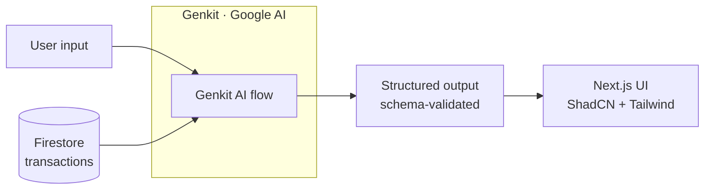

<p align="center">
  
</p>

<h1 align="center">
  
  Caharaya
</h1>

<p align="center">
  <strong>An AI-powered personal finance dashboard for Indonesian users.</strong><br />
  Understand spending, find recurring bills, and get tailored saving advice through conversational AI.
</p>

<p align="center">
  
  
  
  
  
</p>

---

## Overview

Caharaya turns raw transaction data into structured financial insight. It uses [Genkit](https://firebase.google.com/docs/genkit) with Google AI to run a set of typed AI flows that categorize spending, surface recurring bills, and power a finance-aware chat assistant. The UI is built with Next.js 15, ShadCN components, and Tailwind CSS, with Firebase handling authentication and data storage.

## Features

- 🤖 **AI spending analysis** — Automatic categorization and breakdown of transactions.
- 🔁 **Recurring bill discovery** — Detects subscriptions and repeat charges from transaction history.
- 💡 **Personalized saving suggestions** — Actionable advice based on actual spending patterns.
- 📊 **Budget analysis** — Tracks budgets against real activity and flags overspend.
- 💬 **Conversational finance chat** — Context-aware assistant that answers questions about your finances.
- ✨ **Contextual chat suggestions** — Smart follow-up prompts generated from the current conversation.
- 🎯 **Promo finder** — Tool that surfaces relevant deals and promotions.

## Architecture

Caharaya follows a consistent Genkit flow pattern: user input is passed into a typed AI flow, the model returns schema-validated structured output, and the UI renders that output directly. Transaction context comes from Firestore; authentication is handled by Firebase Auth.



Each flow defines an input and output schema, so responses are validated before reaching the client.

## AI Flows

All AI logic lives in Genkit flows backed by Google AI:

| Flow | Function | Description |
| --- | --- | --- |
| Spending analysis | `analyzeSpending` | Categorizes transactions and produces a spending breakdown. |
| Bill discovery | `discoverRecurringBills` | Identifies recurring charges and subscriptions from transaction history. |
| Saving suggestions | `personalizedSavingSuggestions` | Generates personalized saving recommendations from spending patterns. |
| Budget analysis | `budgetAnalysis` | Compares budgets against actual activity and highlights overspend. |
| Finance chat | `runFinancialChatFlow` / `continueFinancialChat` | Answers user questions with conversation and transaction context. |
| Chat suggestions | `getChatSuggestions` | Produces contextual follow-up suggestions for the chat interface. |

## Tech Stack

| Layer | Technology |
| --- | --- |
| Framework | Next.js 15 (App Router) |
| Language | TypeScript |
| Styling | Tailwind CSS + ShadCN UI |
| Auth & Data | Firebase Authentication + Cloud Firestore |
| AI | Genkit (Google AI) |

## Quickstart

### Prerequisites

- Node.js 18.18 or later
- A Firebase project (Auth + Firestore enabled)
- A Google AI API key for Genkit

### 1. Clone and install

```bash
git clone https://github.com/vstalingrady/caharaya_old.git
cd caharaya_old
npm install
```

### 2. Configure environment

Create a `.env.local` file in the project root:

```bash
# Firebase
NEXT_PUBLIC_FIREBASE_API_KEY=your_api_key
NEXT_PUBLIC_FIREBASE_AUTH_DOMAIN=your_project.firebaseapp.com
NEXT_PUBLIC_FIREBASE_PROJECT_ID=your_project_id
NEXT_PUBLIC_FIREBASE_STORAGE_BUCKET=your_project.appspot.com
NEXT_PUBLIC_FIREBASE_MESSAGING_SENDER_ID=your_sender_id
NEXT_PUBLIC_FIREBASE_APP_ID=your_app_id

# Genkit / Google AI
GOOGLE_GENAI_API_KEY=your_google_ai_key
```

### 3. Run the app

Start the Next.js dev server:

```bash
npm run dev
```

In a separate terminal, start the Genkit dev server to run and inspect AI flows:

```bash
npm run genkit:dev
```

The app runs at `http://localhost:3000`. The Genkit developer UI defaults to `http://localhost:4000`.

## Project Structure

```
caharaya_old/
├── src/
│   ├── app/          # Next.js App Router pages and layouts
│   ├── components/   # ShadCN UI and feature components
│   ├── ai/           # Genkit flows and schemas
│   │   ├── flows/    # AI flow definitions
│   │   └── tools/    # Genkit tools (promo finder)
│   └── lib/          # Firebase config and utilities
├── caharayablackbg.svg
└── cahayawebicon.svg
```

## License

See the `LICENSE` file for details.
